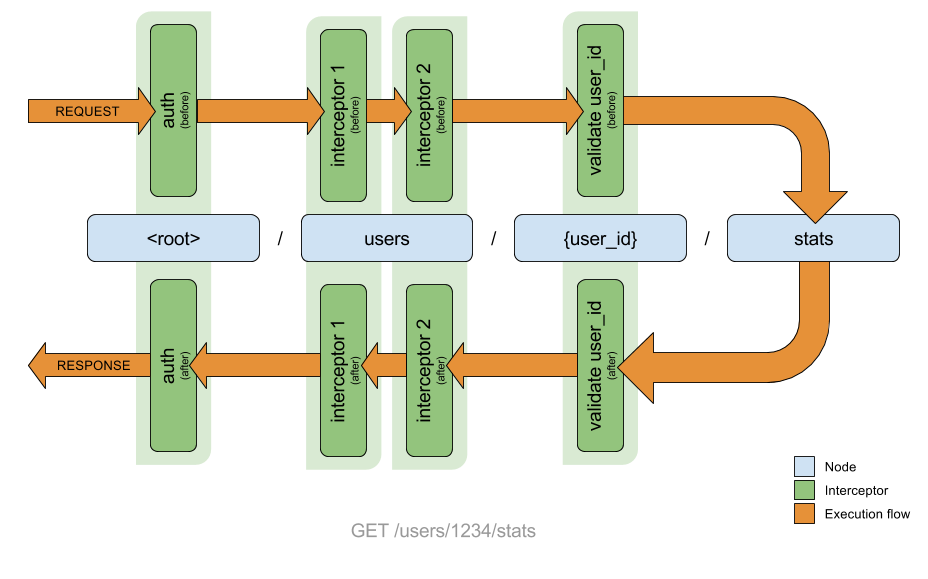

<!-- MarkdownTOC autolink=true bracket=round depth=4 -->

- [Implementation decisions](#implementation-decisions)
    - [Decision #1: Only context](#decision-1-only-context)
    - [Decision #2: The Hollywood Principle](#decision-2-the-hollywood-principle)
    - [Decision #3: Interceptor flow](#decision-3-interceptor-flow)

<!-- /MarkdownTOC -->

# Implementation decisions

This part cover some of the implementation decisions taken along the development process.

## Decision #1: Only context

Handler functions has 1 parameter:

```
func (c *lax.Context) {
    
}
```

Why not `w`, `r` and `c` and maintain developer compatibility?

We would ended up with the following signature:

```
func (w http.ResponseWriter, r *http.Request, c *lax.Context) {
    
}
```

Old code is not going to work by doing copy&paste, but you only have to replace:

* `w` by `c.Response`
* `r` by `c.Request`

Making this decision is hard but `c *lax.Context` is much easier to remember.

About code readability, `w.Write(...)` is shorter but `c.Response.Write(...)` is more semantic.

## Decision #2: The Hollywood Principle

Changing _Middleware_ vs _Interceptor_ is a semantic decision to break up with Sinatra styled frameworks.

Typical middlewares should call to `next()` to continue chaining execution. On the other hand, an interceptor has two parts `Before` and `After` and you don't have to call any `next()` or similar. It follows the _Hollywood Principle_ known as "Don't call us, we'll call you".


## Decision #3: Interceptor flow



Each node in the routing hierarchy executes all its parent nodes interceptors. Why?

This is the desired behaviour for the 95% of the cases or even more. With several advantages:

* You don't have to repeat the interceptor (or middleware) in every endpoint.
* You get prettier, more readable and understandable code.
* Avoid human errors.


